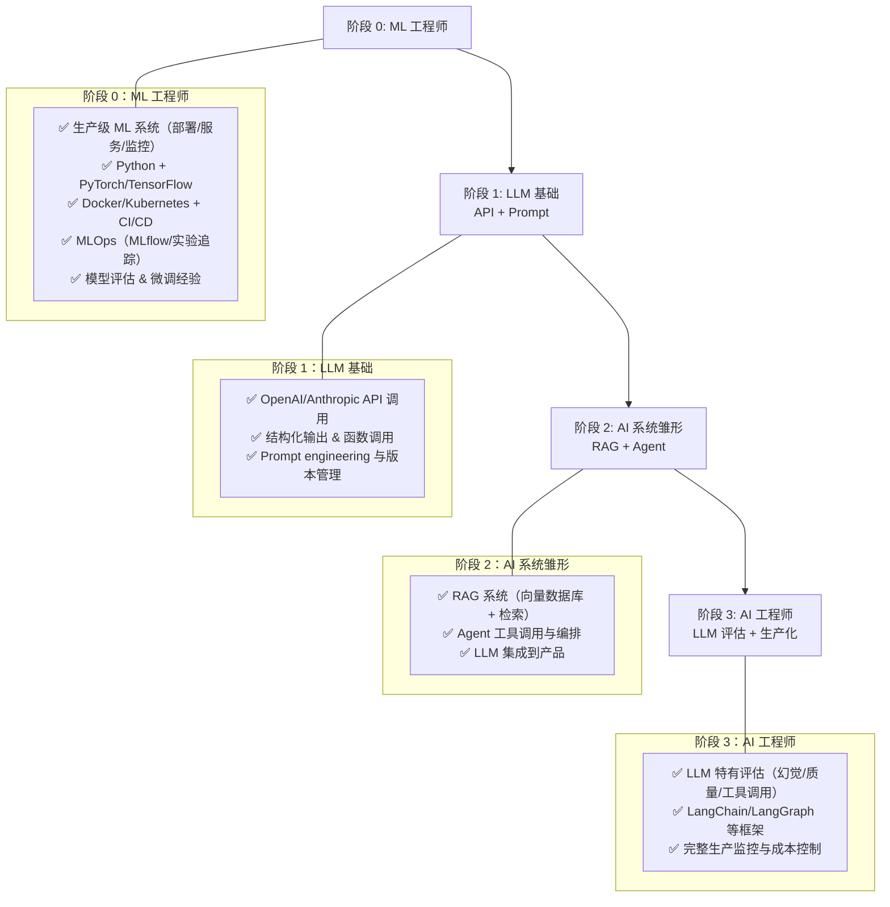

# 从 ML 工程师到 AI 工程师

这大概是所有路径里最容易的一条。两个角色非常相似：你只需要把「调用本地托管模型」替换为「调用 OpenAI 等 API」，其余绝大部分工作都很像。

## 成长时序架构图（从 ML 工程师到 AI 工程师）

## 你已经具备的能力

- 生产级 ML 系统经验：部署、服务、监控
- Python 与 PyTorch/TensorFlow
- Docker、Kubernetes、CI/CD
- 模型评估和指标体系
- 云平台（AWS、Azure、GCP）
- MLOps 实践：MLflow、实验追踪
- 基础设施管理
- 微调经验

## 你需要补充的内容

- LLM API：OpenAI、Anthropic（你习惯自己托管模型，现在需要适应托管在服务商侧）
- Prompt engineering 与 Prompt 版本管理
- RAG 模式：向量数据库、检索策略、分片方式
- Agent 模式：带工具调用的 LLM、编排循环、步数限制等
- LLM 特有的评估：与传统 ML 指标不同，更关注幻觉检测、答案质量、工具调用是否正确等
- 框架：LangChain、LangGraph、LlamaIndex 等

## 为什么这条转型路径可行

ML 工程师的任务是「把机器学习集成到产品」；AI 工程师的任务是「把 AI 集成到产品」。区别在于：AI 工程师通常通过 API 使用第三方模型，而 ML 工程师自己掌握模型权重。

你在模型服务、监控、CI/CD、生产可靠性上的经验可以几乎无缝迁移过来。ML 工程师本身就偏工程，只需要在「LLM 特定的评估方式」上做一些补充。

## 建议学习路径

1. 先开始调用 LLM API：OpenAI、Anthropic，理解结构化输出和函数调用
2. 学 Prompt engineering：迭代、测试、版本管理（很像你熟悉的实验追踪）
3. 搭一个 RAG 系统：用向量数据库和 Embedding（这些概念你已经很熟），把检索与生成结合起来
4. 构建一个 Agent：带工具调用的 LLM、编排循环、多步评估
5. 学 LLM 特有的评估：LLM-as-judge、用于生成质量的黄金数据集

## 时间线

在所有转型路径中，这条往往是最快的。你已经具备工程基础和生产思维，只要把精力集中在 LLM 特有的模式上，很快就能在 AI 工程岗位上高效产出。

## 你的优势

你对模型行为有很深的理解。当一个 LLM 表现不好时，你能更快分辨是 Prompt 问题、上下文问题还是模型能力瓶颈。同时，你也知道在何种场景下应该使用自托管模型而不是云 API（隐私、延迟、成本等），这在需要自托管 LLM 的岗位中非常值钱。

