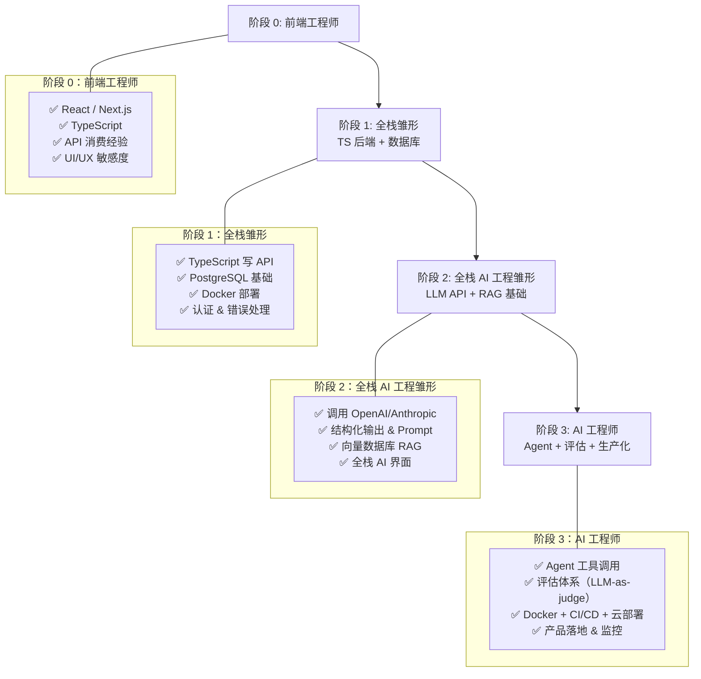

# 从前端工程师到 AI 工程师

**前端工程师的转型路径与其他工程师类似。** AI 工程更偏后端，所以你需要先补足后端能力。但你有一个**独特优势**：你可以真正打通整个全栈，从后端一路到产品 UI，把 AI 能力做成「真正好用的产品」。

**前端工程师学习后端开发参考我的另一个项目的最佳实践：** [Nuct.js](https://github.com/zeeklog/Nuct.js)

## 成长时序架构图

## 你已经具备的能力

这些是你的**核心优势**，直接可以复用到 AI 工程中：

- ✅ **TypeScript/JavaScript** —— 语言基础扎实
- ✅ **React & Next.js** —— 现代前端框架经验
- ✅ **API 集成经验** —— 熟练消费和集成后端服务
- ✅ **UI/UX 敏感度** —— 对 AI 产品用户体验至关重要
- ✅ **产品直觉与用户视角** —— 观察周围人对产品的思考方式（当然他们不一定对）

## 你需要补充的内容

按**优先级分类**学习（建议先基础后端，再叠加 AI）：

### 1. 后端与基础设施
- 用 TypeScript 做后端（初期不一定非要上 Python；如果走 Python 路线可以用 FastAPI）
- 数据库：PostgreSQL、Redis、向量数据库
- Docker 与 CI/CD
- 云平台：AWS、Azure、GCP

### 2. AI 核心技术
- LLM API：OpenAI、Anthropic（包含结构化输出与函数调用）
- Prompt engineering
- RAG 模式：向量检索、Embedding、检索策略
- Agent 模式：带工具调用的 LLM 与编排
- 评估：测试集、LLM-as-judge、质量指标
- 基础 ML 概念：Embedding、微调思路等

## 为什么这条转型路径可行

你**完全可以不用从 Python 入手**，直接用 TypeScript 做 AI 后端——市面上有不少 AI 工程岗位明确要求 TypeScript，也有大量真实项目是 TS 技术栈。

从前端出发，你先走到全栈，再叠加 AI。和其他工程师相比，你的优势在于：**能从后端一路打通到产品 UI**，把 AI 能力真正做成好用的产品，而不是停留在 Demo。

## 建议学习路径

1. **先学后端**：用 TypeScript 写 API，学习数据库
2. **学 Docker 和基础部署**
3. **借助 AI 工具加速**：拿一个 AI 助手（Cursor、Claude Code 等）配合使用，加速后端学习（可以参考字节开源的项目：[deer-flow](https://github.com/bytedance/deer-flow)）
4. **从 LLM API 开始**：在你的后端中调用 OpenAI/Anthropic
5. **做一个全栈 AI 应用**：聊天机器人、RAG 系统或抽取工具——UI 与后端都由你自己完成
6. **学评估**：构建测试集、定义和计算质量指标
7. **学 Agent**：工具调用与编排
