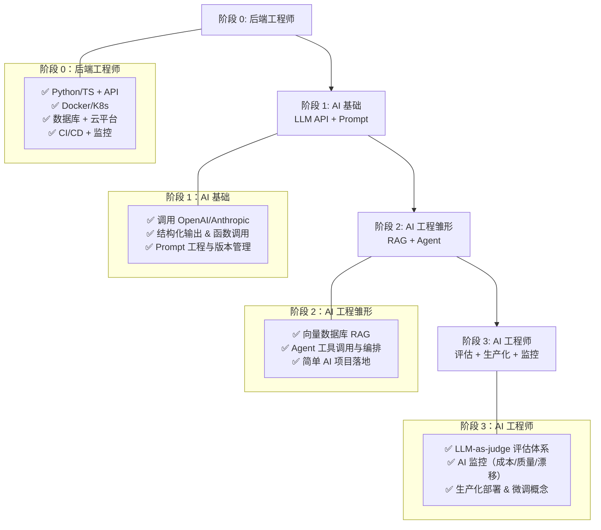

# 从后端工程师到 AI 工程师

**软件工程师是 AI 工程的理想候选人。** 你已经会写代码、写测试，也熟悉大量工程实践。相比「先做研究再补工程」，从已有的工程背景上叠加 AI 要容易得多。

**AI 工程师首先是工程师，其次才是「AI」。**

## 成长时序架构图

## 你已经具备的能力

这些是你的**核心优势**，直接可以复用到 AI 工程中：

- ✅ **Python 或 TypeScript** —— 编程语言扎实
- ✅ **API 开发** —— REST、FastAPI/Flask/Express
- ✅ **测试、CI/CD、代码质量** —— 工程规范完整
- ✅ **Docker & Kubernetes** —— 容器化与编排经验
- ✅ **数据库** —— PostgreSQL、Redis
- ✅ **云平台** —— AWS、GCP、Azure
- ✅ **生产环境部署与监控** —— 微服务架构经验

## 你需要补充的内容

按**优先级分类**学习（直接在现有工程能力上叠加）：

### 1. AI 核心技术
- LLM API：OpenAI、Anthropic（包含结构化输出和函数调用）
- Prompt engineering：迭代、测试、版本管理
- RAG 模式：向量数据库、Embedding、检索策略
- Agent 模式：带工具调用的 LLM、编排循环

### 2. AI 评估与生产化
- 评估体系：LLM-as-judge、黄金数据集、幻觉检测（最重要的新技能）
- AI 特有的监控：输出质量、成本、模型漂移
- 基础 ML 概念：Embedding、微调思路、PyTorch 基础

## 为什么这条转型路径可行

软件工程和 AI 工程的交集非常大。AI 特有的部分主要是 Prompt 设计、版本管理、模型配置，以及特殊的评估方式。对软件工程师来说，评估通常做几次之后就「想明白」了，远谈不上难。

现实里，只要有扎实的软件工程基础，**2-3 个月**就能把一个后端工程师转成可以上手工作的 AI 工程师。

## 建议学习路径

1. **从 LLM API 开始**：调用 OpenAI/Anthropic，熟悉结构化输出和函数调用
2. **做一个简单项目**：聊天机器人、文本分类、信息抽取流水线等，充分利用你已有的后端技能
3. **学习 RAG**：在现有技术栈上加上向量检索（Pinecone、pgvector 或 Weaviate）
4. **学评估**：搭测试集、用 LLM-as-judge、量化质量表现（多数工程师最初都卡在这里）
5. **实现一个 Agent**：带工具调用的 LLM、编排循环、多步工作流
6. **补基础 ML**：Embedding、微调概念、PyTorch 基础
