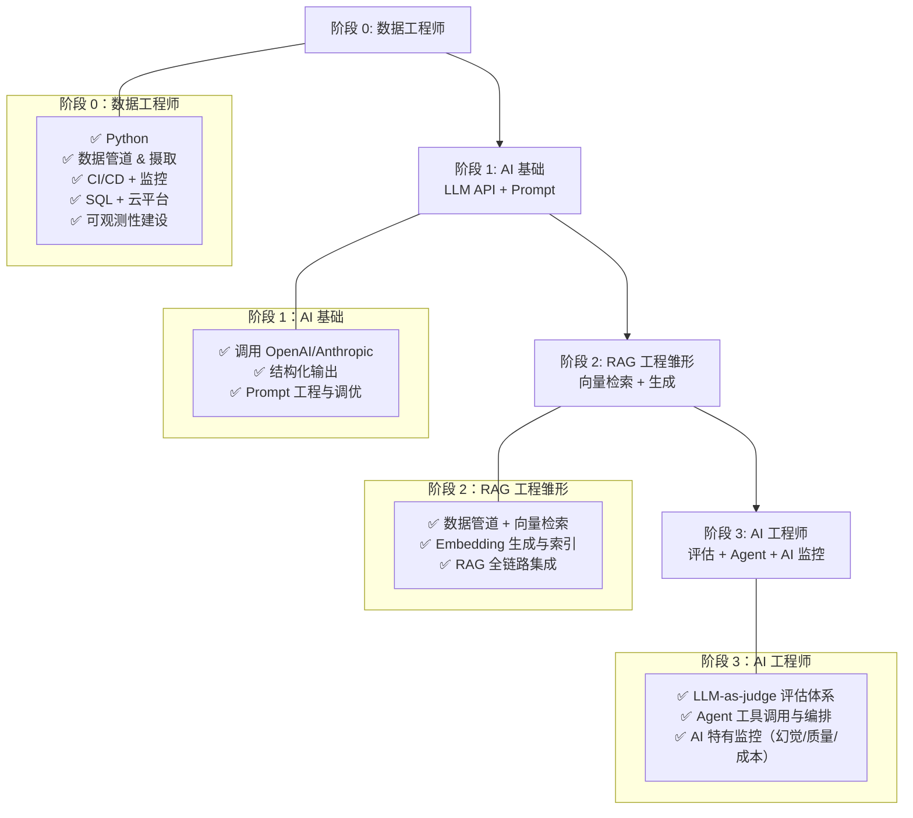

# 从数据工程师到 AI 工程师

数据工程师转向 AI 工程是最平滑的路径之一。AI 工程本质上是工程岗位，而不是研究或科学岗位。大量「AI 工作」其实是 Prompt 调整和工程集成。数据工程师本来就擅长测试、CI/CD、监控，只是监控对象从「数据指标」变成了「AI 行为」，工具和方法非常相似。

## 成长时序架构图

## 你已经具备的能力

- Python
- 数据管道与数据摄取流程——这是 RAG 中最核心的一环
- CI/CD、测试与监控
- SQL 和数据库知识
- 云平台经验（AWS、GCP、Azure）
- 基础设施与部署经验
- 日志收集与可观测性建设

## 你需要补充的内容

- 如何与 LLM 服务商交互（OpenAI、Anthropic 等 API）
- Prompt engineering 与 Prompt 调优方法
- 如何评估 AI 系统——这是最关键的新技能
- RAG 模式：你已经会建数据管道，现在要补「检索 + 生成」这半边
- Agent 模式：带工具调用的 LLM
- AI 特有的监控（幻觉检测、输出质量追踪等）

## 为什么这条转型路径很适合你

以 RAG 为例，你需要一个搜索引擎；搜索引擎需要数据；数据需要摄取管道——这基本就是数据工程师一贯在做的事。你完全可以先以「为 AI 团队做数据管道和基础设施」的身份加入，然后逐步往 AI 侧靠拢。

在 AI 时代，数据工程本身也更加重要：没有数据工程，AI 系统根本无法正常运行，搜索和检索模块都会失灵。

## 建议学习路径

1. 先学 LLM API：从调用 OpenAI/Anthropic 开始，理解结构化输出
2. 搭一个 RAG 系统：这是最自然的切入点——你已经会管道，现在加上向量检索和 LLM 生成
3. 学评估：如何构建测试集、衡量检索质量、实践 LLM-as-judge
4. 引入 Agent：让 LLM 调用工具，构建简单工作流和编排
5. AI 特有监控：在现有监控体系上扩展，加入对 AI 输出行为的监控

## 时间线

在系统学习 3–4 个月 AI 相关测试与评估后，一个数据工程师通常就可以胜任 AI 工程岗位。因为你原本就有工程基础，所以门槛会比很多人低。

## 你的优势

你可以补上很多 AI 工程师在「数据侧」的短板：为 RAG 搭建可靠的数据管道、保障数据质量、建设底层基础设施等。这些是很多只做「建模/Prompt」的工程师比较欠缺的能力，也是大公司的核心需求之一。
