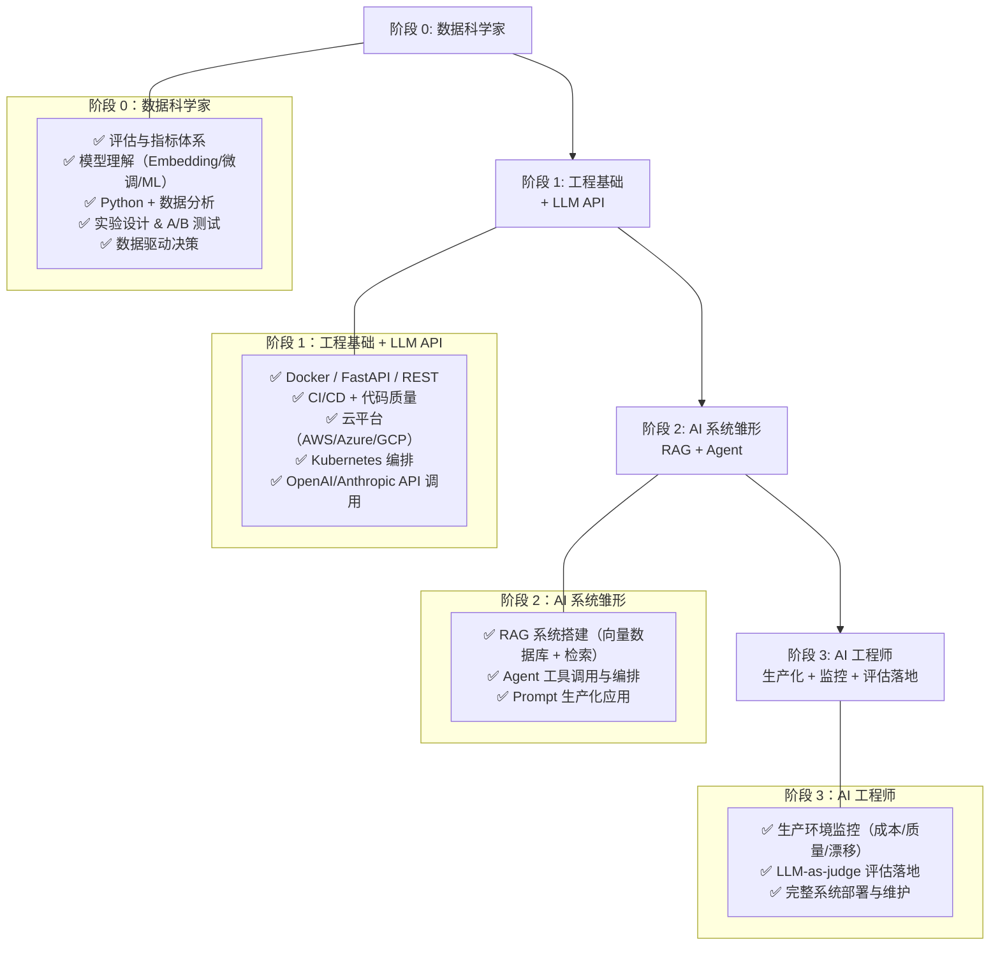

# 从数据科学家到 AI 工程师

数据科学家和 ML 工程师都是非常合适的未来 AI 工程师。数据科学家天然具备的「评估思维」是 AI 工程中最关键的能力之一，主要的差距在于工程侧。

## 成长时序架构图（从数据科学家到 AI 工程师）

## 你已经具备的能力

- 评估与指标体系——这是 AI 工程的核心能力
- 模型理解：Embedding、微调、ML 基础等
- Python 与数据分析
- 实验设计与 A/B 测试
- 对模型行为和失败模式的理解
- 数据驱动决策方式

## 你需要补充的内容

- 工程最佳实践：测试、CI/CD、代码质量
- 生产环境部署：Docker、FastAPI、REST API
- 云平台：AWS、Azure、GCP
- Kubernetes 与容器编排
- LLM API：OpenAI、Anthropic（和你自己训练模型完全不同）
- RAG 模式：向量数据库与检索
- Agent 模式：带工具调用的 LLM 与编排
- 生产环境监控（不仅仅是 Notebook 里的指标）

## 为什么这条转型路径可行

AI 工程师既要懂「科学」又要懂「工程」，但通常不做真正的模型训练，因为模型已经存在。大部分精力花在 Prompt 调优和系统搭建上。对数据科学家而言，评估是非常熟悉的概念；对传统软件工程师来说，评估往往要多做几次才真正「领悟」，这里你反而是有优势的。

现实团队里，AI 工程师和数据科学家经常在同一个组里协作。如果一个团队还没有 AI 工程师，数据科学家往往会顺势承担 AI 工程相关工作。所需的技能其实你大多已经具备，只需要补上工程严谨性与工程化落地能力。

## 建议学习路径

1. 补工程基础：测试、CI/CD、Git 工作流、Code Review
2. 学 Docker 与基础部署：先把容器化用顺手
3. 从 LLM API 入手：调用 OpenAI/Anthropic，搞清楚结构化输出与 Prompt 设计
4. 做一个有评估的 RAG 系统：把你已有的评估能力和新的 AI 模式结合起来
5. 增强生产技能：监控、日志、FastAPI 服务化
6. 学习 Agent：带工具调用的 LLM 及编排框架

## 一点残酷的现实

只会做分析、只会训模型、工作只停留在 Notebook 的数据科学家，这几年已经越来越难找工作了。很多传统建模任务，用一次 gpt-4o-mini 之类的模型就能替代。

但如果你补上工程能力，问题就不大。全栈型数据科学家和通才型工程师，从来不愁工作，不管职位叫 Data Scientist 还是 AI Engineer，都能很快适应新需求。

## 你的优势

评估正在变成新的核心「护城河」。做一个聊天机器人不难，难的是证明它「真的好用」。公司真正愿意花钱雇的是会衡量系统效果的人——LLM-as-judge、黄金数据集、幻觉检测、漂移监控，这些能力区分了候选人。你已经习惯这样思考，这是天然优势。

